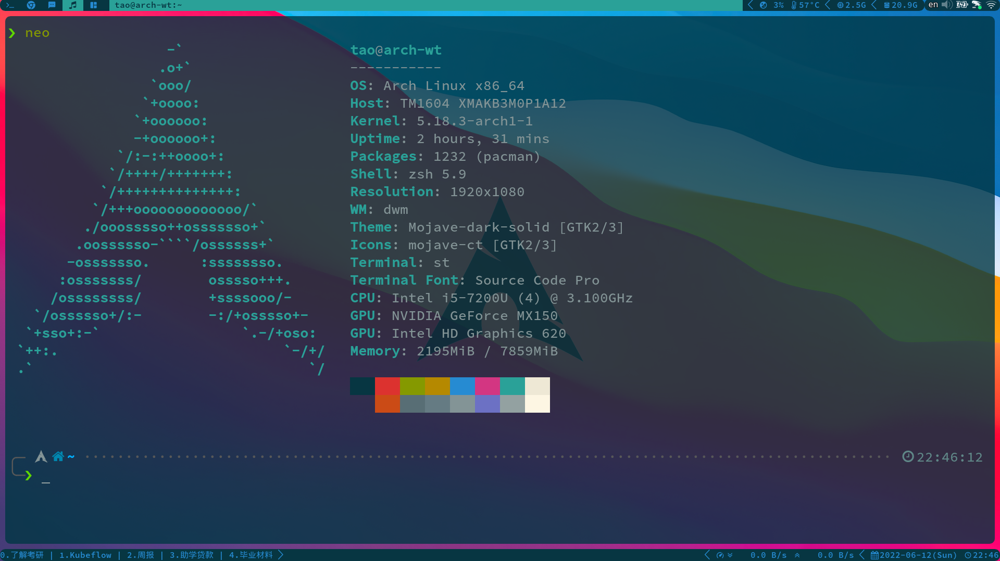

# Dwm

## Install

```shell
git clone https://github.com/BYT0723/dwm.git

cd dwm

# 将目录下的.dwm软链到home中
ln -s ~/.dwm ./.dwm

sudo make clean install

```

## Patches

Installed patches are stored in the `patches` folder

```shell
dwm-attachbottom-6.3.diff
dwm-autostart-20210120-cb3f58a.diff
dwm-awesomebar-20200907-6.2.diff
dwm-cfacts-vanitygaps-6.2_combo.diff
dwm-fullscreen-6.2.diff
dwm-hide_vacant_tags-6.3.diff
dwm-pertag-20200914-61bb8b2.diff
dwm-systray-6.3.diff
dwm-viewontag-20210312-61bb8b2.diff
```

## Preview

`neofetch` show system information

`tmux` + `mpd` + `ncmpcpp`


### warn

Please do not install the alpha patch, because the systray patch has already been installed, if you continue to install the alpha patch, it will cause it to fail to start

If you have other issues, please read config.h carefully or go to [suckless](https://dwm.suckless.org)

If you also want to create your own dwm, vim environment, I recommend [theniceboy](https://github.com/theniceboy) to you.
and some teaching videos [TheCW](https://www.bilibili.com/video/BV11J411t7RY)
